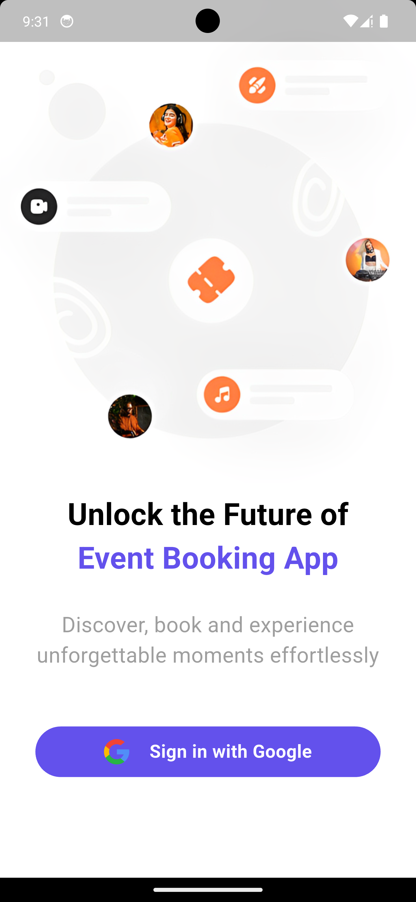
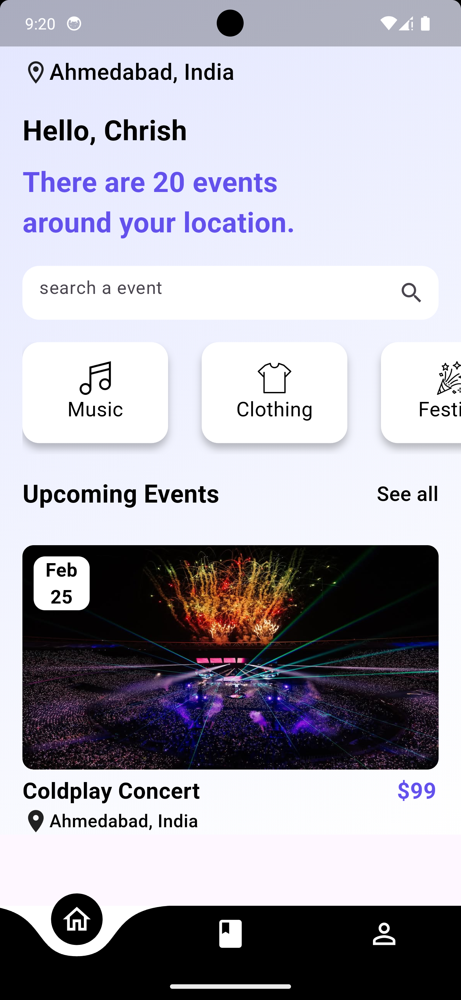
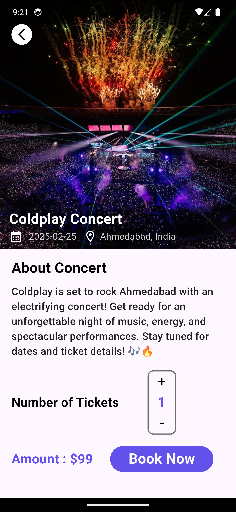
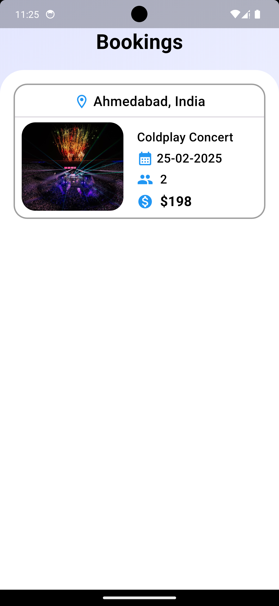
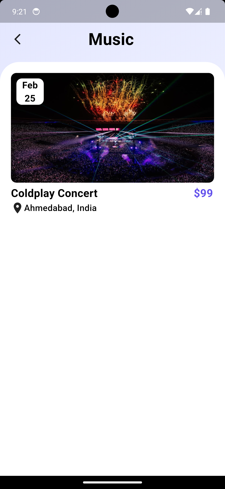
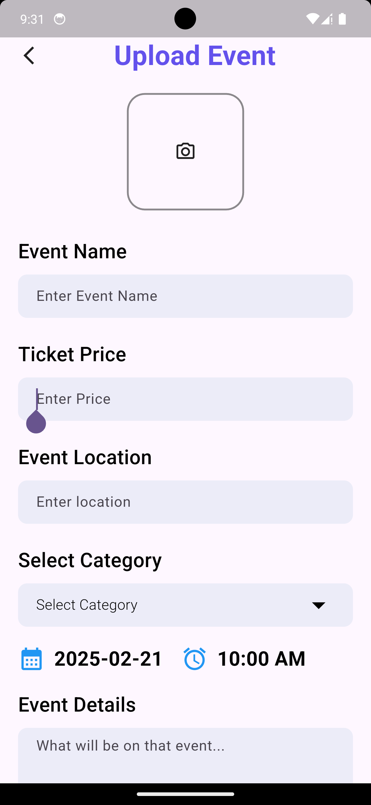

# 🎫 Eventgo: Concerts Booking App  

**Eventgo** is a Flutter-based concert booking application that allows users to explore, book, and manage event tickets seamlessly. It includes an **admin panel** for event management and integrates **Firebase Firestore** for backend operations and **Flutter Stripe** for secure payments.  

---

## 🚀 Features  

### 🔹 User Features  
✅ **Google Sign-In** for quick authentication.  
✅ Browse and filter events by **category** (Music, Festival, Clothing, Food, etc.).  
✅ Location-based event recommendations on the **home page**.  
✅ View event details, including **thumbnail, name, price, location, date, and description**.  
✅ **Secure ticket booking** using **Flutter Stripe** payment gateway.  
✅ Access **booking history** and view purchased tickets.  

### 🔹 Admin Features  
✅ Secure **email-password login** for admin.  
✅ **CRUD Operations**: Admin can **upload, update, and delete** events.  
✅ Add event details, including **image, name, ticket price, location, date, and description**.  
✅ Monitor **ticket sales and event performance**.  

---

## 🔹 Technical Stack  
- **Frontend**: Flutter (Dart)  
- **State Management**: Provider/Riverpod/Bloc  
- **Backend**: Firebase Firestore  
- **Authentication**: Firebase Auth (Google Sign-In, Email/Password for Admin)  
- **Payments**: Flutter Stripe Integration  
- **Storage**: Firebase Storage (for event images)  
- **Location Services**: Google Maps API (for location-based event suggestions)  

---

## 📸 Screenshots  

### 🔹 App Screens  

<table>
  <tr>
    <td></td>
    <td></td>
    <td></td>
    <td></td>
   
    
  </tr>
  <tr>
    <td align="center"><b>Signup Page</b></td>
    <td align="center"><b>Home page</b></td>
    <td align="center"><b>Event details</b></td>
     <td align="center"><b>Ticket Page</b></td>
     
     
  </tr>
  <tr>
     <td></td>
    <td></td>
  </tr>
  <tr>
    <td align="center"><b>Event categ</b></td>
    <td align="center"><b>Upload event</b></td>
  </tr>
</table>
---

## 🔧 Installation & Setup  

### 1️⃣ Clone the Repository  
```sh
[git clone https://github.com/ayushpal166/Eventgo/]
cd Eventgo


